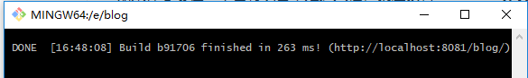

# VuePress搭建（一）
最简单的vuepress搭建步骤

------

1. 下载安装[node.js](https://nodejs.org/en/)

2. 安装并运行

   ```bash
   #设置淘宝镜像
   npm install -g cnpm --registry=https://registry.npm.taobao.org
   
   # 全局安装
   npm install -g vuepress
   
   # 创建一个markdown文件
   echo '# Hello VuePress' > README.md
   
   # 运行
   vuepress dev
   ```

3. 访问启动成功后控制台地址即可



