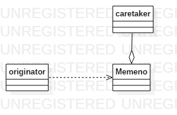

# 备忘录模式

*季文子三思而后行，子闻之，曰：再，斯可矣！*

凡事三思而后行，就可以尽可能的减少出错的概率，但是如果最终还是又可能会有错，这时候我们该如何改正呢？现实中也行很难，但是在程序设计中确实可以实现的。而这种类似于吃后悔药的实现方式称之为备忘录模式

## 定义

备忘录模式是在不破坏封装的前提下，将一个对象的状态保存在外部，当需要时可以进行恢复。它是一种行为型设计模式（非官方定义，自己理解的）

## 场景假设及代码实现

小明和小刚下象棋，通过代码实现棋子类

那么棋子类会有哪些属性呢？

- x坐标
- y坐标
- 棋子名称

棋子会有哪些行为呢——会动

```java
@Data
public class Chessman {
    private int x;
    private int y;
    private String name;
    
    public void move (int x, int y) {
        this.x = x;
        this.y = y;
    }
    
}
```

上述简单的棋子类就已经可以实现我们的下棋需求了（不考虑吃子儿的情况）

由于小明和小刚都是新手，所以会时不时的进行悔棋，那么我们该如何修改代码来完成悔棋这一需求呢

```java
@Data
public class Chessman {
    //保存上一步走的位置
    private int lastx;
    private int lasty;
    
    private int x;
    private int y;
    private String name;

    public void move (int x, int y) {
        this.lastx = x;
        this.lasty = y;
        this.x = x;
        this.y = y;
    }
	//将上一步的位置还原
    public void repent() {
        this.x = this.lastx;
        this.y = this.lasty;
    }

}
```

上述代码确实可以实现我们的需求，但是缺违反了单一职责原则——棋子只需要记录自己的当前位置，不需要记录上一步走的位置，于是我们将其上一步的位置专门用一个备忘录类来记录

```java
@Data
class Memento {
    private int x;
    private int y;
}
```

并且在移动棋子时记录其上一步的状态以及还原时将其还原

```java
@Data
public class Chessman {
    private int x;
    private int y;
    private String name;
    private Memento memento;

    public Chessman() {
        memento = new Memento();
    }

    public void move (int x, int y) {
        memento.setX(this.x);
        memento.setY(this.y);
        this.x = x;
        this.y = y;
    }

    public void repent() {
        this.x = this.memento.getX();
        this.y = this.memento.getY();
    }

}
```

虽然上述代码可以实现我们备忘录用来记录和还原的操作，但是却又违反了单一职责原则

- 棋子类不需要保存备忘录。
- move方法之应该移动棋子，却不应该保存其状态到备忘录中

于是我们新增一个专门用来保存备忘录的负责人类，并且将move方法拆分

```java
@Data
public class MementoCaretaker {
    private Memento memento;
}

@Data
public class Chessman {
    private int x;
    private int y;
    private String name;

    public void move (int x, int y) {
        this.x = x;
        this.y = y;
    }

    public Memento save() {
        return new Memento(this.x, this.y);
    }

    public void repent(Memento memento) {
        this.x = memento.getX();
        this.y = memento.getY();
    }

}

@Data
public class Memento {
    private int x;
    private int y;

    Memento(int x, int y) {
        this.x = x;
        this.y = y;
    }

}
```

这时需求发生了变化，如果小明和小刚下棋的时候想悔棋很多步呢？那就需要我们保存很多的备忘录，修改代码如下

```java
@Data
public class MementoCaretaker {
    private List<Memento> memento = new ArrayList<>();
}
```

## 总结

备忘录模式类图如下



其中包含三个角色

- originator：原生类，也就是需要保存的业务类，在上述代码中对应chessman类
- memeno：备忘录类，用来保存业务类的状态
- caretaker：负责人类，用来持有备忘录

备忘录模式可以帮助我们防止对象被外部破坏，也可以让我们任意的回到我们所需要的某一个状态。但是请注意，保存状态是需要代价的，最显著的代价就是对内存资源的消耗，所以当需要保存的资源过大或资源过多时就需要在业务或技术上对备忘录模式进行优化