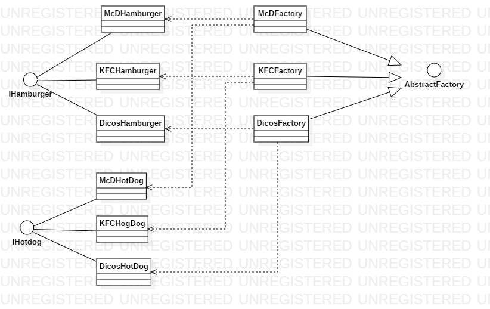

# 设计模式——工厂模式

工厂模式属于创建型设计模式。顾名思义，在工厂模式中，类的创造不通过*new*来实现，而是从类工厂中获取。而由于业务的复杂程度不同，工厂模式又可细分为一下三类

- 简单工厂模式
- 工厂方法模式
- 抽象工厂模式

### 场景假设

假设我们现在想要吃汉堡，但是汉堡既有KFC的，又有金拱门的，该如何选择呢？

### 示例

首先我们使用简单工程模式（又称静态工厂方法模式）来描述上述场景，其类图如下


如图所示，我们将首先将汉堡**抽象化**，而后使用连个类分别实现KFC和金拱门的汉堡，并通过简单工厂来创建这些汉堡。在简单工厂模式中，存在三种角色

- 工厂角色：工厂角色负责实现创建索引产品实例的内部逻辑，它的返回类型为**抽象产品**，图中对应SimpleFactory
- 抽象产品角色：工厂角色所创建的对象的父类，封装了各种产品对象的公有方法，图中对应IHamburger
- 具体产品角色：继承或实现抽象产品角色，图中对应KFCHamburger和McDHamburger

工厂代码如下

```java
public class SimpleFactory {

    public final static String KFC = "KFC";
    public final static String McD = "McD";

    public static IHamburger getInstance(String type) {
        if(type == KFC){
            return new KFCHamburger();
        }else if(type == McD){
            return new McDHamburger();
        }else {
            return null;
        }
    }
}
```

我们创作了一个既可以生产KFC汉堡，又可以生产金拱门汉堡的工厂类，当我们需要一个汉堡时，我们只需要告诉这个工厂我们想要的汉堡类型就可以了。

#### 小结

> 优点
>
> - 简单
> - 根据外界条件明确获取指定对象
>
> 缺点
>
> - 当产品过多时，工厂代码变得非常复杂
> - 不符合开闭原则
>
> tip：简单工厂模式在我们日常开发中用到的地方很多，但是其并**不属于**GoF23种设计模式

但是这时我们突然又想吃德克士的汉堡了？当前工厂并不能满足我们的需求，那么我们该如何进行修改呢？没错，我们不得不在原有类的基础上进行更改，如此一来就违反了我们设计的7大原则之一的**开闭原则**。

于是乎我们就有了新的考虑与设计——工厂方法模式，类图如下


在工程方法模式中，我们为每一类产品都增加了一个工厂，这样在我们想要一种新的类型的产品时，不需要改动原来的代码，直接新增就可以了

在上图中，我们将工厂类抽象化，这个抽象化的工厂就是相对于简单工厂模式增加的角色——**抽象工厂** 

工厂代码如下

```java
public abstract class AbstractFactory {
    public abstract IHamburger getHamburger();
}

public class KFCHamburgerFactory extends AbstractFactory {
    @Override
    public IHamburger getHamburger() {
        return new KFCHamburger();
    }
}

public class McDHamburgerFactory extends AbstractFactory {

    @Override
    public IHamburger getHamburger() {
        return new McDHamburger();
    }
}

public class DicosHamburgerFactory extends AbstractFactory {
    @Override
    public IHamburger getHamburger() {
        return new DicosHamburger();
    }
}
```

在工厂方法模式中，每一类产品都有一个专门的工厂负责生产，当我们需要新的产品时，增加一个工厂就可以了，并不需要对原有类进行修改，**符合开闭原则**

#### 小结

> 优点
>
> - 基类提供缺省实现，子类可重写。增加了灵活性
> - 屏蔽产品类，调用者无需了解具体产品类
> - 新增产品时无需修改已有代码，符合开闭原则
>
> 缺点：当产品过多时，会造成工厂类的激增

这个时候我们不想吃汉堡了，突然想吃热狗

热狗在KFC、金拱门、德克士都是有的，如果仅仅是通过增加工厂的方式的话就会造成**工厂类的激增**，这是我们不愿意看到的，于是乎，抽象工厂模式应运而生

在理解抽象工厂模式之前，我们先来了解一个概念——**产品族**


如上图，不同厂家生产的汉堡属于同一个产品等级，同一厂家生产的不同事物属于同一个产品族，在抽象工厂模式中，每个工厂负责一个产品族的产品

抽象工厂模式类图如下



如上图所示，每个类型的工厂负责制作当前工厂的汉堡和热狗，也就是每个工厂负责一个产品等级的产品的生产

工厂代码如下

```java
public abstract class AbstractFactory {
    public abstract IHamburger getHamburger();
    public abstract IHotDog getHotDog();
}

public class DicosFactory extends AbstractFactory {
    @Override
    public IHamburger getHamburger() {
        return new DicosHamburger();
    }

    @Override
    public IHotDog getHotDog() {
        return new DicosHotDog();
    }
}

public class KFCFactory extends AbstractFactory {
    @Override
    public IHamburger getHamburger() {
        return new KFCHamburger();
    }

    @Override
    public IHotDog getHotDog() {
        return new KFCHogDog();
    }
}

public class McDFactory extends AbstractFactory {
    @Override
    public IHamburger getHamburger() {
        return new McDHamburger();
    }

    @Override
    public IHotDog getHotDog() {
        return new McDHotDog();
    }
}

```

于是在这种模式下，我们解决了工厂类激增的问题，当然也引入了一个新的问题，那就是当我们需要新增加一个产品族时候，会需要将所有类都修改一次——如果之前的厂商也需要生产这种产品的话。所以，如果业务复杂到需要使用抽象工厂模式的话，首先需要做的就是**对产品类进行合理规划**以避免出现增加产品族的情况

#### 小结

> 优点
>
> - 保证了客户端代码使用的是同一产品族中的产品
> - 减少了工厂的数量，避免了工厂类激增
> - 增加产品族时无需修改已有代码，符合开闭特性
>
> 缺点：增加产品等级时异常麻烦，需要修改所有工厂类（如果原工厂类需要新增的产品等级）

### 总结

那么工厂方法模式和抽象工厂模式是否符合类设计原则呢？统计如下表

|              | 工厂方法模式 | 抽象工厂模式 |
| ------------ | ------------ | ------------ |
| 开闭原则     | √            | 乄           |
| 里氏代换原则 | √            | √            |
| 迪米特原则   | √            | √            |

可以看到，工厂方法模式是符合我们的涉及目标的，而抽象工厂模式由于对产品类做了一个汇聚的操作，使得其并不是完全符合开闭原则。

**个人感悟**

- 其实工厂方法模式和抽象工厂模式的区别主要在于对产品的归类，或者说工厂方法模式是产品类没有族关系的抽象工厂模式的一种表现。而对于简单工厂模式，最突出的特点应该是其实现简单，同样其缺点也很突出
- 在开发过程中，创建一个对象往往需要一些参数，工厂模式可以简化客户端手动获取参数的操作


### 参考博客

[（工厂模式）产品族和产品等级](https://www.jianshu.com/p/5fb1e21c4d19)