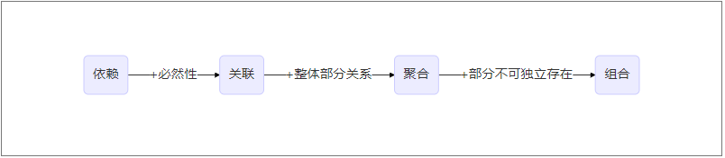

# 设计模式（前篇）

[[toc]]

Notice：在接下来的日子里，本站将会有一系列的设计模式相关的文章发布，本文作为设计模式系列博文的前篇。发布周期大约为两周一篇，每篇会对一种或几种有对比性的设计模式进行分析。

## 知识储备

为了更好的理解设计模式，首先需要明确的了解两个知识点

- 类之间的关系
- 类设计原则

### 类之间的关系

类与类之间的连接有这么几种关系：

泛化、实现、依赖、关联、聚合、组合

其中泛化、实现、依赖相对比较容易理解，java中的体现也比较明确。

- 泛化代表**继承**，在java中代表泛化关系的关键字是**extends**。
- 实现代表**实现**，在java中代表泛化关系的关键字是**implement**
- 依赖代表偶然性的关联，在java中代表泛化关系的表现是**局部变量**

而对于关联、聚合、组合而言，在java中的表现都是以**成员变量**的形式，具体是哪种类之间的关系，需要根据上下文的语境来判断，只给出一份java代码而不明确其代表含义是无法判断类之间的关系的，下面将介绍这几种关系的区别

关联关系中的两个类**完全相互独立**。可以是一对一、一对多、多对一。比如厨师和刀的关系，厨师切菜其实是刀切菜，厨师可以使用多把刀，每把刀也可以给多个厨师使用。

聚合关系代表一种“**has-a**”的关系。强调一种**整体与部分**之间的关系。比如厨师组与厨师，厨师组由多个厨师组成，厨师组、每一个厨师也可以单独存在。

组合关系代表一种“**is-a**”的关系。不仅强调**整体与部分**之间的关系，而且**代表整体的对象也要对部分的生命周期负责，组合关系不能共享**，如果代表整体的对象被销毁，那么部分也会被销毁。举例如人体和器官

依赖、关联、聚合、组合的关系图如下

接下来我们就来分析下方这个图

大黑是一只**实现**了大雁接口的大雁，具有大雁的一切特征，它呼吸的时候**依赖**于空气，大黑由两个翅膀和其他的器官**组合**而成。小黑是大黑的孩子，**继承**了大黑的全部特性。冬天来了，包括大黑小黑在内的一群大雁**聚合**在一起向南飞去

### 类设计原则

- **单一职责原则（SRP）**：一个类只负责一个功能领域中的相应职责，或者可以定义为：就一个类而言，应该只有一个引起它变化的原因
- **开闭原则（OCP）**：一个软件实体应当**对扩展开放，对修改关闭**。即软件实体应尽量在不修改原有代码的情况下进行扩展

  实现开闭原则的关键在于**抽象化**
- **里氏代换原则（LSP）**：所有引用基类（父类）的地方必须能透明地使用其子类的对象。

  里氏代换原则是实现开闭原则的重要方式之一，由于使用基类对象的地方都可以使用子类对象，因此在**程序中尽量使用基类类型来对对象进行定义**，而在**运行时再确定其子类类型**，用子类对象来替换父类对象。
- **依赖倒置原则（DIP）**：抽象不应该依赖于细节，细节应当依赖于抽象。换言之，要针对接口编程，而不是针对实现编程

  依赖倒转原则要求我们在程序代码中传递参数时或在关联关系中，尽量引用**层次高的抽象层类**，即使用接口和抽象类进行变量类型声明、参数类型声明、方法返回类型声明，以及数据类型的转换等，而**不要用具体类**来做这些事情
- **接口隔离原则（ISP）**：使用多个专门的接口，而不使用单一的总接口，即客户端不应该依赖那些它不需要的接口。

  注意：在使用接口隔离原则时，我们需要注意控制接口的粒度，接口不能太小，如果太小会导致系统中**接口泛滥**，不利于维护；接口也不能太大，太大的接口将违背接口隔离原则，灵活性较差，使用起来很不方便
- **迪米特原则（LOD）/最少知识原则（LKP）**：一个软件实体应当尽可能少地与其他实体发生相互作用

  形象的来说就是不要和“陌生人”说话、只与你的“直接朋友”通信，朋友如下
  - 当前对象本身(this)
  - 以参数形式传入到当前对象方法中的对象
  - 当前对象的成员对象
  - 如果当前对象的成员对象是一个集合，那么集合中的元素也都是朋友
  - 当前对象所创建的对象

- **组合/聚合复用原则（CARP）**：尽量使用**对象组合**，而不是继承来达到复用的目的。

::: TIP

一般地，可以把这七个原则分成了以下两个部分：

**设计目标**：开闭原则、里氏代换原则、迪米特原则
**设计方法**：单一职责原则、接口分隔原则、依赖倒置原则、组合/聚合复用原则

::: 

只看概念或许有些难以理解，这些设计原则在我们遭遇难以重构的系统问题时，或许能起到很大的作用，[Liuwei-Sunny](https://me.csdn.net/LoveLion)博客中的介绍我觉得很棒，对于每一个设计原则都给出了重构的实例，理解不了的可以去看一下

在了解了以上两个知识点之后，在接下来设计模式的学习中就会变得游刃有余

## 设计模式简介

设计模式是什么？设计模式就是对一些不断重复发生的问题以及该问题的解决方案的核心

如设计模式参考书中提到的，一共有23种设计模式，这些模式可以分为三大类：创建型模式（Creational Patterns）、结构型模式（Structural Patterns）、行为型模式（Behavioral Patterns）

- **创建性设计模式**

  > 这些设计模式提供了一种在创建对象的同时隐藏创建逻辑的方式，而不是使用 new 运算符直接实例化对象。这使得程序在判断针对某个给定实例需要创建哪些对象时更加灵活。
- **结构型模式**

  > 这些设计模式关注类和对象的组合。继承的概念被用来组合接口和定义组合对象获得新功能的方式。
- **行为型设计模式**

  > 这些设计模式特别关注对象之间的通信。
