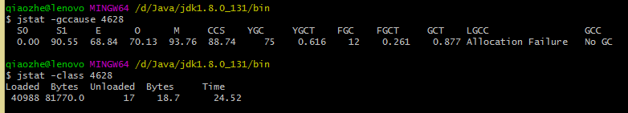

# IDEA调优实战

[[toc]]

最近学习了关于JVM的一些知识，一时技痒的我终于要对IDEA下手了

那么调优究竟是调哪些方面呢？当然是哪块儿用着不顺调哪块儿了，目前来看IDEA貌似没什么用着不顺手的。。。那还是从启动速度和运行优化方面来调一调吧。

## 调优开始

既然是启动速度方面的优化，那首先就是需要知道每次启动用了多长时间，那么对于同样是java程序的idea，启动时间分别消耗在了类的装载、卸载和gc上，对于这两块儿时间，可以分别使用**jstat -class port**和**jstat -gc port**查到

:::tip

端口号可通过 **jps -l** 命令查询

:::

第一次启动：



可以看到，类的装载卸载花费了大部分的时间，这些时间都是必要的，但是其中有一项**字节码验证时间**，由于idea已经是相当成熟的工具了，它的编译代码我们可以认为是可靠的，不需要再加载的时候再进行字节码验证，因此，我们可以通过参数**-Xverify:none**禁止掉字节码验证过程。

出去类加载以外，垃圾回收共用了0.877s。其中full gc12次，耗时0.261s；minor gc75次，耗时0.616s。在短短的30s内，进行了如此多次的gc，推测大概率是初始堆内存不足以及新生代内存过小导致的，但是推测归推测，还是需要找到证据来验证我们的推测的。

好在jdk中已经为我们预备了工具来检测，这个工具就是jvisualvm。在jdk的bin目录下打开这个工具，安装Visual GC插件，监控idea程序。

jvisualvm图：


可以看到，堆的大小是发生了改变了的，说明确实存在内存初始内存不足的现象。这个时候我们就需要将初始化内存写大一点来减少gc了，那么具体应该写多少呢？这种时候就需要gc日志的帮助了，打印gc日志通过添加以下两个参数来获取

```ini
-XX:+PrintGCTimeStamps 打印日志信息
-Xloggc:log_gc.log gc日志输出文件
```

gc日志：


由gc日志可以看出最后的堆大小成长到了267200k，也就是260多M，所以我们初始化的堆内存设置为512M应该可以“包住”，而年轻代我们可以看到，每次回收后都会剩下大约167000k左右的内存不会被回收掉，所以年轻代我们可以设置成256M来减少minor gc的次数

到这里为止，根据工具和日志的调整就已经告一段落了，当我们找到idea的虚拟机初始化参数进行更改时发现，idea使用的是CMS收集器，为了更好的性能，我们可以把其换成G1

## 成果

至此，idea的调优就已经全部完成了，来看看我们的成功吧。

启动参数：

```ini
-Xms1024m
-Xmx1024m
-Xmn512m
-XX:MetaspaceSize=512m
-Xverify:none
-XX:ReservedCodeCacheSize=240m
-XX:+UseG1GC
-XX:SoftRefLRUPolicyMSPerMB=50
-XX:+PrintGCTimeStamps
-Xloggc:log_gc.log
```

调优后启动时间


可以看到，类加载的时间缩短了4s，垃圾收集其中full gc次数为0，minor gc次数为5，大大的减少了垃圾回收的时间