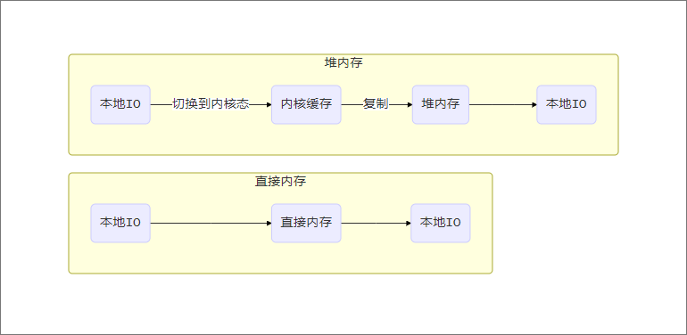
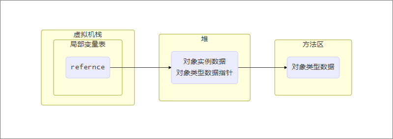

# Java内存区域

在我们的日常编程中，常常会有这样的疑问

- new的对象究竟储存在哪里呢？

- 对象究竟是根据哪里的模板生成的呢？

- 为什么我进入一个方法并执行完毕之后还能返回我进入的位置呢？

  ......

那么本文就来从Java内存区域的角度来说一说这些问题

[[toc]]]

## 内存区域介绍


如上图所示，Java的运行时区域分为如上5个部分

1. Heap：Java堆。用于存放对象实例和数组，分为年轻代和老年代，年轻代又可分为survior区和Eden区

2. 虚拟机栈：最小单元为栈帧，每个方法的开始和完成就对应着一个栈帧的入栈与出栈操作，每个虚拟机栈都是线程独立的。在栈顶的栈帧被称为当前栈帧，当前线程只处理当前栈帧。在虚拟机栈中保存了动态链接、操作数栈、局部变量表、返回地址等信息。

   > - 动态链接：符号引用在编辑阶段就转为直接引用的称为静态连接，在程序运行时解析为直接引用的程为动态链接
   >
   > - 操作数栈：存放操作数
   >
   >   > 一条add指令需要两个操作数，这两个操作数就会放在操作数栈中，当执行add时进行出栈相加操作
   >
   > - 局部变量表：存储方法参数信息以及方法中定义的局部变量
   >
   > - 返回地址：正常返回时取PC计数器中的地址，异常返回则由异常处理器处理

3. 本地方法栈：native方法所使用的栈

4. 程序计数器：记录当前线程执行到了哪里，线程独立

5. 方法区：存储每个类的类型数据如运行时常量池，属性和方法数据

除此之外还有两部分区域是我们需要关注的

1. 运行时常量池：运行时常量池属于方法区的一部分，在《Java虚拟机规范》中对这部分的定义是这样的

   > A *run-time constant pool* is a per-class or per-interface run-time representation of the `constant_pool` table in a `class` file

   也就是说运行时常量池是每个类或接口的class文件中的常量池的运行时体现

2. 直接内存：直接内存并不属于运行时区域，但是在开发过程中我们确实可以用到，使用直接内存进行IO将会拥有比使用堆内存进行IO更高的效率，这是由于其数据流的流转不同而造就的

   

   > 上图解释
   >
   > - 传统文件IO时，Java进程又用户态切换为内核态，而后从内核缓存中将数据拷贝到堆内存中
   > - 使用直接内存时，直接内存可以直接映射到需要操作的文件。

   ::: tip

   虽然直接内存的操作比传统IO要快，是直接内存的申请却慢于堆内存的申请

   :::

## 字符串常量池

在JVM内存区域中，还有一个不可忽视的区域——字符串常量池。字符串常量池是一种池技术，它会将首次创建的字符串放入池中，String#intern()方法可以获取其引用

将一个字符串添加到字符串常量池有两种方式

1. 使用“”，

2. 使用String#intern()方法

   ```java
   String a = "123";
   String b = new String("1") + new String("23").intern();
   ```

那么既然池技术是一种缓存技术，缓存使用的内存就有可能溢出，将这块儿内存单独领出来说一说就是因为其在生产环境中有可能溢出，而且在不同的jdk版本，字符串的实现方式和储存区域都做了改变。首先我们来看下边一段代码

```java
    public void stringPoolPlaceTest() {
        String a = new StringBuilder("vay").append("mh").toString();
        System.out.println(a == a.intern());
    }
```

上述代码的运行结果在1.6中是*false*，在1.7之后版本是*true*

字符串常量池在1.6中位于永久代中，当使用intern方法时，会将堆中的对象复制到常量池中。而在1.7之后，字符串常量池被移到了堆中，当使用intern方法时，会在常量池中创建其引用，而后保存其引用并返回其引用

## 对象的访问定位

jvm堆对象的访问是通过虚拟机栈中的局部变量表中的reference来访问的，方法方式可以分为两种

1. 句柄
2. 直接指针

如果使用句柄的方式，则需要在堆中专门划分出一块儿空间当作句柄池，其访问如下图


如果使用直接引用的方式，则需要考虑如何存储其对象类型数据指针



在Hotspot虚拟机中，采用的是直接指针的方式，直接引用对比句柄的方式最大的优势就是少了一次访问，当数据量足够时这就是一笔相当可观的开销，但是其实使用句柄方式则可以在堆中数据移动是不改变reference，只需要改变对象实例数据指针即可

## Q&A

- 运行时常量池是class常量池的运行时体现，class常量池的字面量中包括字符串。
  - class常量池中的字符串字面量何时添加到字符串常量池中？
  - class常量池属于方法区，字符串常量池在堆中，字符串常量池可以保存class常量池中的字面量的引用吗？
- 元空间和直接内存都使用的是本地内存，二者有什么关系吗？

  - 相同点
    - 都使用本地内存
  - 不同点
    - 元空间内存由虚拟机控制，当类加载器被卸载后将释放这个类加载器加载的类
    - 直接内存由用户管理内存
