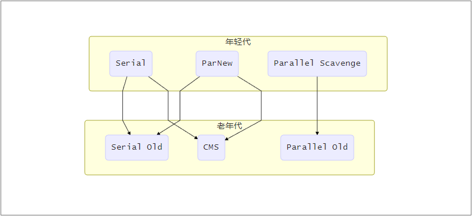
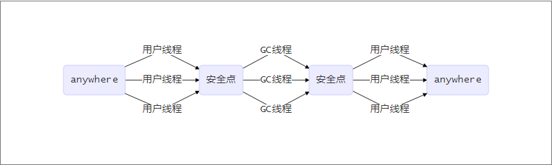
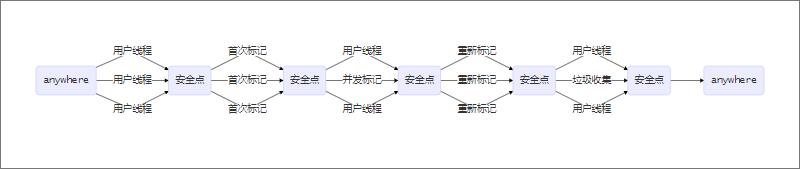
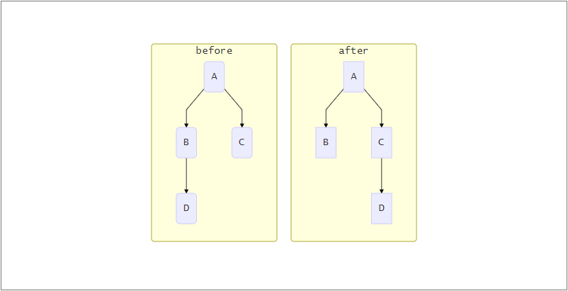

# 垃圾收集器

上一章中说到了垃圾回收算法，那么垃圾回收算法是如何实现以及在jvm中是如何体现的呢？这就是本章所要说的内容。jvm中使用垃圾回收器来实现垃圾回收算法

在Hotspot中，垃圾回收使用的是分代回收算法。将java堆分为了年轻代和老年代。分别使用不同的垃圾收集器来进行垃圾回收，如下图所示



接下来我们逐一分析这些垃圾收集器

[[toc]]

## 年轻代垃圾收集器

Hotspot在年轻代中有三种收集器可以供大家选择：Serial、ParNew、Parallel Scavenge

### Serial

Serial是“最古老“的垃圾收集器，它使用的是标记-复制法进行垃圾回收。该垃圾收集器是一个单线程收集器，其收集垃圾的过程如下图


### ParNew

ParNew垃圾收集器是Serial的多线程版本，它们也共用了很多代码，但是在一些情况下ParNew并不比Serial更高效，如果是在单CPU的机子上，Serial由于没有线程的切换，反而效果更好，其收集垃圾的过程如下图



### Parallel Scavenge

Parallel Scavenge收集器和前两种收集器最大的不同在于其关注的并不是最短停顿时间，而是吞吐量
```
吞吐量=程序运行时间/(程序运行时间+垃圾回收时间)
```

Parallel Scavenge收集器也是一个并发收集器，在Parallel Scavenge收集器中，我们可以设置两个参数来对其进行控制

- 吞吐量
- 最大停顿时间

需要注意的是，并不是将最大停顿时间设置的很小系统就越快，Parallel  Scavenge收集器会通过频繁的垃圾回收来保证最大停顿时间

## 老年代

### Serial Old

Serial Old是Serial的老年代版本，采用标记整理算法，也是一个单线程的收集器

### Parallel Old

Parallel Old收集器是Parallel Scavenge的老年代版本。在Parallel Old垃圾收集器出现之前，Parallel Scaverge垃圾收集器只能和Serial Old老年代垃圾收集器配合使用，而Serial Old垃圾收集器在server状态下的表现很差，Parallel Old垃圾收集器出现之后，才有了真正意义上的关注于吞吐量的垃圾收集器的组合

### CMS

CMS——Cocurunt Mark Swap，从其名字我们就可以看出其特性：并发垃圾收集器，采用标记清除算法



CMS的垃圾清除过程可以分为如下几步

- 初次标记

  标记GC ROOTS直接引用的对象

- 并发标记

  GC ROOTS Tracing的过程，可以和用户线程同时进行

- 重新标记

  修改在并发标记阶段由于用户线程的运行而产生变动的标记记录

- 垃圾清除

缺陷

1. CPU资源敏感
2. 无法处理浮动垃圾
3. 标记清除算法本身缺陷

## G1

G1——Garbage First，从jdk1.7中加入，在jdk1.9中将其设置为jvm的默认处理器。其使命为在未来代替CMS处理器，然而其并不仅仅是一个老年代垃圾收集器，G1的内存管理范围是整个Java堆。

### 新的内存区域划分

G1将内存分为了一个个Region，当然在G1中也保存了年轻代和老年代的概念，但是G1中的老年代和年轻代已经不是一整块连续的内存了，而且一系列Region的集合。其内存分配逻辑图如下


其中Humongous区域用来存储大对象，由于G1整体采用的是标记复制算法，使用专门的一类区域来进行存储可以避免大对象在垃圾回收时进行复制

### 垃圾回收

G1垃圾收集器中有两种垃圾回收方式：Young GC和Mix GC

#### Young GC

Young GC回收使用的是标记复制算法。它的触发条件为Eden区满了。

Young GC进行垃圾回收时Eden区的存活对象放入Survior to区，放不下的进入老年代；Survior from区放入Survior to区，满足晋升年龄的晋升至老年代。由于采用的同样是标记复制算法，在对对象进行标记时，如果年轻代有老年代的引用，就需要对全部老年代进行遍历，为了解决每次Young GC时都需要对老年代全部遍历的问题，G1引入了两个概念

- Card，每一个Region被分成了一个个Card，概念类似于书的每一页
- Remebered Set，简称RSet，是一个Hashtable，key为Region的起始值，Value是一个集合，记录Card的下标。RSet用来记录本区域被哪些区域引用，每个Region一个

#### Mix GC

Mix GC会回收部分老年代和整个年轻代。

Mixed GC采用的同样是标记复制算法，其并发标记流程图如下


在这里要介绍一种算法——**三色标记法**，这也是CMS和G1使用的标记算法

- 首先将GC ROOTS标记为黑色，于其直接相连的对象标记为灰色，其余的对象为白色

- 进行引用链遍历，被遍历到的对象被标记为灰色

- 标记结束后为白色的对象就是不可达对象，可以被回收

由于并发标记的过程是和用户线程一起进行的，所以在标记的过程中会出现下图情况



如图，在并发标记时对象的引用关系如before，并发标记之后对象的引用关系如after，那么对于这种情况，我们就需要对在并发标记阶段变动的对象关系进行记录，那么什么时候进行记录呢？有两种情况

1. 在插入时记录
2. 在删除时记录

CMS和G1分别使用第一种和第二种，并发标记阶段对操作的对象进行记录，在最终标记时对记录的信息在进行处理

在并发标记完成之后的某一时刻开始垃圾回收，垃圾回收采用的同样是标记复制算法，我们都知道标记复制算法是需要额外的空间进行担保的，Mix GC针对的是整个堆，那么如何进行担保呢？

如果Mix GC在进行垃圾回收时发现to-space空间不足，就会触发Full GC

### Q&A

- Mix GC什么情况下会触发呢？
  - 我们都知道，G1收集器是可以通过设置*-XX:MaxGCPauseMillis*参数预测停顿时间的。G1会通过垃圾回收来建立自己的垃圾回收模型，当其认为回收这些垃圾可能会停顿目标时间时，就会触发Mix GC
  - -XX:InitiatingHeapOccupancyPercent参数可以设置老年代占整个堆的大小，当老年代超过这个阈值时，也会触发Mix GC

- 除了Mix GC担保失败还有哪种可能会触发Full GC？

  用户申请内存的速度大于垃圾回收的速度

- 在G1中我们是可以设置垃圾收集期望时间的，那么G1是如何在规定的时间内回收尽可能多的垃圾呢？

  在G1种有一个垃圾回收价值表，用来记录每个Region的垃圾回收价值，在收集垃圾阶段，G1收集器会在设定时间内，优先回收价值高的Region

## JVM参数表

| 参数                            | 作用                                  |
| ------------------------------- | ------------------------------------- |
| UseSerialGC                     | Serial+Serial Old                     |
| UseParNewGC                     | ParNew+Serial Old                     |
| UseConcMarkSweepGC              | PParNew+CMS+Serial Old                |
| UseParallelGC                   | Parallel Scanvenge+Serial Old         |
| UseParallelOldGC                | Parallel Scanvenge+Parallel Old       |
| SurvivorRatio                   | Eden与Survivor的比例，默认8：1        |
| PretenureSizeThreshold          | 大于该值直接在老年代分配              |
| MaxTenuringThreshold            | 晋升老年代的年龄                      |
| UseAdaptiveSizePolicy           | 动态调整晋升老年代的年龄              |
| HandlePromotionFailure          | 允许担保失败                          |
| ParallelGCThreads               | 使用Parallel Scanvenge时的线程数      |
| GCTimeRatio                     | 吞吐量                                |
| MaxGCPauseMills                 | 最大停顿时间                          |
| CMSInitiationOcccupancyFraction | 内存满足多少时进行垃圾回收            |
| UseCMSCompactAtFullCollection   | 在CMS垃圾回收后进行内存压缩           |
| CMSFullGCsBeforeCompaction      | 在CMS进行若干次垃圾回收后进行内存压缩 |
| UseG1GC                         | 使用G1垃圾收集器                      |
| InitiatingHeapOccupancyPercent  | 老年代在堆中的比例，大于时触发Mix GC  |

## 参考资料

[G1从入门到放弃（一）](<https://www.jianshu.com/p/548c67aa1bc0>)

[对G1垃圾回收器的理解](https://blog.csdn.net/zhou2s_101216/article/details/79202893)

《深入理解Java虚拟机》