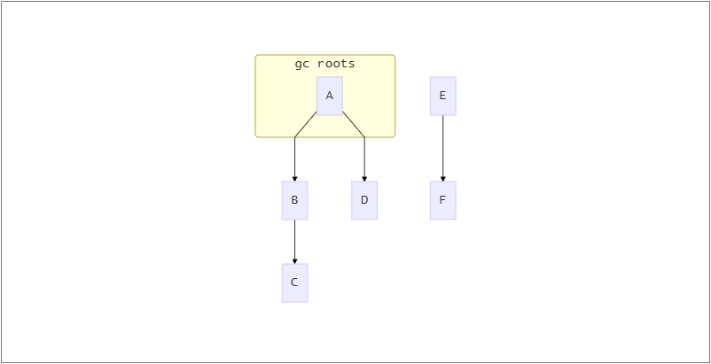

# 垃圾收集算法

如果要问C++和Java最大的区别是什么，那一定是内存回收。在C++中，程序员既像是上帝，可以对所有的内存进行操作，又像是打杂的，需要对每个内存进行管理。而在Java中，JVM有专门的内存管理机制，程序员并不需要对内存进行管理

既然要对内存进行管理，那就一定有这么几个问题

- 什么样的内存是需要被回收的
- 什么时候进行回收
- 如何回收

在Java的发展历程中，出现了两类垃圾收集算法对上述问题进行了解答

## 引用计数法

在引用计数法中，jvm为每个对象增加一个引用计数器，每当被一个对象引用时，该对象的引用计数器加1，当引用失效时，该对象的引用计数器减一，所有引用计数器为0的对象都是可以被回收的。

引用计数法无法解决循环引用的问题，如下图


对象A引用了对象B，对象B又引用了对象A，那么在垃圾回收时对象A、B则都不会被回收

由于Hotspot使用的不是该类算法，故不作深入探究

## 可达性算法

在介绍可达性算法之前，我们首先引入根节点（GC ROOTS）的概念。

1. 临时变量表中对象引用的对象
2. 类变量引用的对象
3. 方法区常量引用的对象
4. 本地方法栈中引用的对象

由根节点为起始，开始向下寻找其引用的对象，所经过的路程称为引用链，如果一个节点无法通过引用链到达根节点，则称该对象不可达，不可达的节点都是可以被回收的节点

	

如上图所示，A为根节点，BCD为可达节点，EF为不可达节点，EF在垃圾回收时可以被回收

可达性算法根据实现方式的不同又可分为4种

### 标记清除法

正如其算法名称，标记清楚法分为两个步骤

- 对所有对象进行标记
- 对不可达对象进行清除

问题：会产生大量的碎片

### 标记复制法

将内存一分为二，在其中任意一个区域进行内存分配，当该区域内存不足时，对该区域进行内存回收

- 对该区域的所有对象进行标记
- 回收不可达对象，并将存活的对象移至另一个区域

问题：内存浪费，浪费了一半的区域，代价过高

> 经研究发现，eden区域的对象大多都有着“朝生夕死”的特征，所以新生代将年轻代分为了eden区、survior0和survior1区，每次垃圾回收时将eden和survior区中存活的对象移动到另一个survior区，当然需要老年代进行担保，以防止另一个survior区域放不下存活的对象

### 标记整理法

并不是在标记清除的基础上增加了整理这一步骤

- 对所有对象进行标记
- 将所有存活对象向一端移动
- 清除所有剩余内存

### 分代收集法

将内存区域分为几部分，对每一部分分别采用上述几种方法。在JVM中我们将Java内存区域分为年轻代和老年代，年轻代使用标记复制法，而老年代则使用标记清除法或者标记整理法，不能使用标记复制法，因为没有别的区域来为老年代进行担保了

## 引用

无论是可达性算法还是引用计数法，都在强调一个词——引用。在Java中，引用分为四种

**强引用**

直接新建对象，或使用“=”来引用

```java
Object a = b
```

**软引用**

当有可能抛出内存溢出时会回收软引用，在Java中使用SoftReference类实现，结合ReferenceQueue使用可在被回收时收到通知

```java
    /**
     * 软引用测试
     * <p>
     *     -Xms10m
     *     -Xmx10m
     * </p>
     */
    public void SoftRefTest() {
        SoftReference<String> s = new SoftReference<>(new String(new byte[2 * 1024 * 1024]), queue);
        byte[] a = new byte[4 * 1024 * 1024];
        System.out.println(s.get()==null?"软引用已被回收":s.get());
    }
```

**弱引用**

弱引用的对象可以坚持到下一次垃圾回收，在Java中使用WeakReference类实现，结合ReferenceQueue使用可在被回收时收到通知

```java
    public void WeakRefTest() {
        WeakReference<String> a = new WeakReference<>(new String("weak"), queue);
        System.gc();
        System.out.println(a.get()==null?"弱引用已被回收":a.get());
    }
```

**虚引用**

该引用没有任何实际作用，仅仅会在结合ReferenceQueue使用使用时，当对象被回收时收到通知