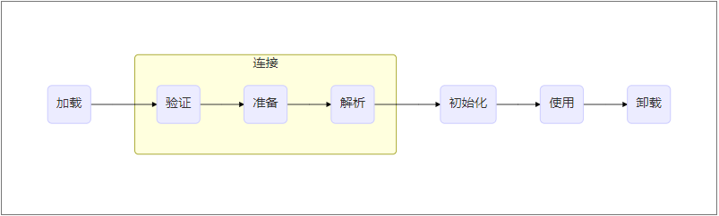
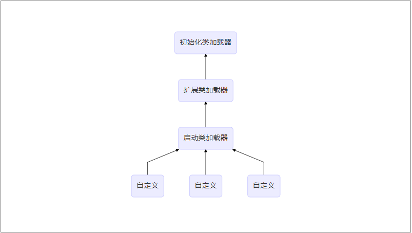

# 类加载机制

[[toc]]

一个类时如何被虚拟机加载运行？究竟经历了哪些步骤呢？本文就Java中类的加载机制进行详细的讲解。

## 加载过程

一个类从被虚拟机加载直到被虚拟机卸载的过程程为类的生命周期，可分为以下7个步骤

每个类都会经历以上7个步骤，其中加载、验证、准备、初始化、卸载这五个步骤将按部就班的**开始**，而解析则不一定，解析可能会在初始化之后才开始进行

### 加载

加载阶段的工作，根据类的全限定名获取类的二进制流

1. 类加载器根据类的全限定名获取类的二进制流
2. 根据二进制流所代表的数据结构在方法区生成对应的数据结构
3. 根据数据结构在方法区生成java.lang.Class对象作为该类的入口

类的加载阶段是程序员们可操作性最大的阶段、我们可以使用虚拟机自带的类加载器，也可以自定义类加载器

### 验证

由于二进制流的获取途径后很多，可以通过Java文件、网络、直接使用二进制编辑器编写、数据库、JSP，所以就需要对加载进来的class进行验证，主要验证一下4个方面

1. 文件格式验证
2. 元数据验证（Java语法验证）
3. 字节码验证（自卫验证，防止有对虚拟机有害的代码）
4. 符号引用验证（是否每个符号引用都可以找到对应的类）

验证阶段和加载阶段有一部分时交叉进行的，而且如果验证程序是没有问题的话在实施阶段可以通过*-Xverify:none*来关闭

### 准备

再通过验证之后，虚拟机就要对所有的**类成员变量**进行内存分配，此时并不对实例对象进行内存分配。这个时候的类成员变量还是其零值，类成员变量的零值如下表

| char    | '\u0000` | int       | 0        |
| ------- | -------- | --------- | -------- |
| long    | 0.0f     | short     | (short)0 |
| boolean | false    | reference | null     |
| float   | 0        | double    | 0.0d     |
| byte    | (byte)0  |           |          |

但是对于已经被final修饰过的类成员变量，在准备阶段就已经赋为了实际值

### 解析

解析阶段的工作就是将符号引用转化为直接引用

> **符号引用**：以一些符号来对类进行描述，也可以是任意的形式，只要在引用的时候可以无歧义的找到类即可
>
> **直接引用**：可以是直接指向类的指针、偏移量或者是间接指向类的符号

每个类可能被多次解析，解析结果在虚拟机中有缓存保留，第一次解析成功后，接下来的解析也应保证其解析成功

### 初始化

在初始化阶段，虚拟机为每一个类收集并生成\<clint>方法，\<clint>方法由**static静态代码块**和**静态赋值语句**生成，如果一个类中没有上述代码则不生成\<clint>方法。其收集顺序取决于在代码中的顺序，static静态代码块可以修改在其之后的静态变量，但是却不能访问。每个类的\<clint>方法执行之前其父类一定已经初始化，接口则不需要。虚拟机可以保证\<clint>方法的线程安全，所以单例模式的饿汉式是线程安全的

当且仅当类在以下五种情况下会进行初始化

1. 当遇到new、putstatic、getstatic、invoke指令时
2. main方法所在类
3. 当一个类被初始化时，其父类一定已经完成了初始化，所以第一个初始化的类一定是Object
4. 当使用java.lang.invoke时
5. 当使用java.util.methodHandle时

以上五种情况称为对类的主动引用，当然还有几种对类的被动引用

- 通过子类来引用父类中的final类变量
- 数组
- 引用一个类中的final型的类变量

## 类加载器

如上文提到，在加载阶段，虚拟机根据**类的全限定类名**来获取类的二进制流，而这一步是放在虚拟机之外进行的。对于虚拟机而言，类加载器分为两类，初始化加载器和其他，但是其实根据其加载职责的不同还可以再进行细分

- 启动类加载器：加载\<JAVA_HOME>\lib文件夹下的类
- 扩展类加载器：加载\<JAVA_HOME>\lib\ext下的类
- 系统类加载器
- 自定义加载器

为什么要对加载器进行这样的划分呢？因为类的唯一性是由类及其加载器来判断的，如果两个相同的对象使用不同的加载器进行加载，那么其一定是不等的，例如Class#isInstance，Class#equals，instanceof关键字

### 双亲委派模型(Parents-Delegation-Model)

Java团队对于自定义的类加载器提供了这么一种加载机制——parents delegation model，也由于译者的原因，翻译成中文之后就变成了双亲委派模型，笔者在首次读到的时候就有一个疑惑，为什么是双亲而不是单亲呢？双亲指的是哪两个呢？其实都不是的！应该的翻译为父类委派模型，每个类其实只要一个父类，其关系如下图

#### 概念

类加载器加载类时应首先交给其父类进行加载，如果父类无法加载，则由自己进行加载。值得注意的是，由系统提供的这三个加载器并不是继承的关系，而是组合关系。

如果我们想自定义一个加载器，应该怎么做呢？

1. 继承ClassLoader类
2. 不破坏双亲委派模型则重写findClass类，破坏则重写loadClass类

> 文末链接为一个自定义获取磁盘上任意class文件的一个小例子

双亲委派模型在Java的发展历程中经历过三次大规模的”被破坏“

1. 双亲委派模型是在jdk1.2版本提出的，而在Java1.0~Java1.2之间一直都是被破坏状态
2. 双亲委派模型解决了类优先级的问题，但是也会导致顶层的类加载器无法加载较高层的代码，所以为了解决这一问题，引入了一个线程上下文加载器，默认继承创建线程的类的加载器
3. 热部署OSGi

