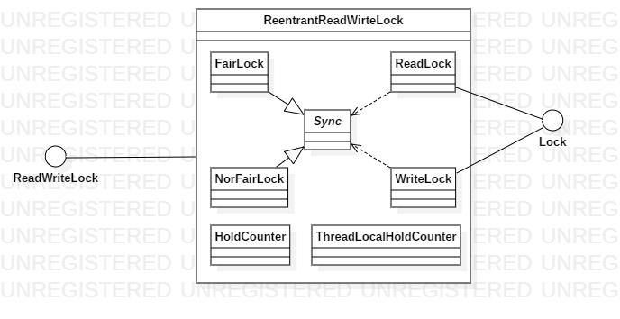

# AQS框架之ReentrantReadWriteLock实现类

现在就只剩下一个常量我们没有用到了：PROPAGATE，这个常量在ReentrantReadWirteLock类中有用到，既然是读写锁，那么其特性有哪些呢？

- 当读锁被占有时，后续依然可以获取读锁
- 当读锁被占有时，写锁不可被获取
- 当写锁被占有时，读写锁都不可被获取
- 由类名可知，锁可重入

status这个域是用来记录重入锁的次数的，非0即为锁被获取，那么就有几个问题会被抛出

- 如何用一个值既要记录读锁的重入数，又要记录写锁的重入数？
- 读锁是可以被多个线程共同持有的，每个线程又有自己的重入数，如何记录？

ReentrantReadWirteLock的类图如下



可以看到，在ReentrantReadWirteLock类中多出了两个内部类，其源码如下

```java
static final class HoldCounter {
    int count = 0;
    final long tid = getThreadId(Thread.currentThread());
}

static final class ThreadLocalHoldCounter
    extends ThreadLocal<HoldCounter> {
    public HoldCounter initialValue() {
        return new HoldCounter();
    }
}
```

其中，HoldCounter类用来保存本线程的重入数，而每个线程使用ThreadLocal来保存HoldCounter，这里引出ReentrantReadWirteLock类中的几个私有域

| 域名                 | 类型                   | 备注                         |
| -------------------- | ---------------------- | ---------------------------- |
| readHolds            | ThreadLocalHoldCounter | 当前线程读锁的重入数         |
| cachedHoldCounter    | HoldCounter            | 最后一个成功申请读锁的重入数 |
| firstReader          | Thread                 | 第一个获取读锁的线程         |
| firstReaderHoldCount | int                    | 第一个获取读锁的线程的重入数 |

每个线程自己的读锁的重入数保存在readHolds中，接下来我们来看下读锁的申请锁源码

```java
public void lock() {
    sync.acquireShared(1);
}
public final void acquireShared(int arg) {
    if (tryAcquireShared(arg) < 0)
        doAcquireShared(arg);
}
```
这两段代码就已经规定好了申请读锁的大框架——尝试申请锁失败，进入循环阻塞


```java
protected final int tryAcquireShared(int unused) {
    Thread current = Thread.currentThread();
    int c = getState();
    //有且仅有独占线程不是当前线程时会返回-1，即失败
    if (exclusiveCount(c) != 0 &&
        getExclusiveOwnerThread() != current)
        return -1;
    int r = sharedCount(c);
    if (!readerShouldBlock() &&
        r < MAX_COUNT &&
        //尝试获取读锁
        compareAndSetState(c, c + SHARED_UNIT)) {
        //读锁没有被获取过
        if (r == 0) {
            firstReader = current;
            firstReaderHoldCount = 1;
        //读锁被重入获取
        } else if (firstReader == current) {
            firstReaderHoldCount++;
        } else {
            HoldCounter rh = cachedHoldCounter;
            if (rh == null || rh.tid != getThreadId(current))
                cachedHoldCounter = rh = readHolds.get();
            else if (rh.count == 0)
                readHolds.set(rh);
            rh.count++;
        }
        return 1;
    }
    return fullTryAcquireShared(current);
}
```

在尝试获取读锁的那段代码就回答了我们的第一个问题，ReentrantReadWirteLock将status值分为了两部分，前16位保存读锁的总重入数，后16位保存写锁的重入数

```java
private void doAcquireShared(int arg) {
    //--（1）--
    final Node node = addWaiter(Node.SHARED);
    boolean failed = true;
    try {
        boolean interrupted = false;
        for (;;) {
            final Node p = node.predecessor();
            if (p == head) {
                int r = tryAcquireShared(arg);
                if (r >= 0) {
                    //--（2）--传播
                    setHeadAndPropagate(node, r);
                    p.next = null; // help GC
                    if (interrupted)
                        selfInterrupt();
                    failed = false;
                    return;
                }
            }
            if (shouldParkAfterFailedAcquire(p, node) &&
                parkAndCheckInterrupt())
                interrupted = true;
        }
    } finally {
        if (failed)
            cancelAcquire(node);
    }
}
```

看到上述doAcquireShared方法是不是很眼熟，这代码结构明显就和doAcquire一模一样啊。没错，但是还是有一些不同

- 添加节点时添加的是Node.SHARED模式而不是独占模式（Node.EXCLUSIVE）

这里引入在Node节点中的两个常量

```java
/** Marker to indicate a node is waiting in shared mode */
static final Node SHARED = new Node();
/** Marker to indicate a node is waiting in exclusive mode */
static final Node EXCLUSIVE = null;
```

- 当申请成功时，多了一行setHeadAndPropagate方法

我们设想这么一个场景：*当前写锁被占有，然后来了几个申请读锁的线程，这几个线程被阻塞排队，而后写锁被释放，第一个申请读锁的线程获取到锁*。这个时候，后续的读锁也应该获取到读锁。这种情况我们称其为读锁传播，也就是setHeadAndPropagate做的事情

```java
private void setHeadAndPropagate(Node node, int propagate) {
    Node h = head; // Record old head for check below
    setHead(node);
    if (propagate > 0 || h == null || h.waitStatus < 0 ||
        (h = head) == null || h.waitStatus < 0) {
        Node s = node.next;
        if (s == null || s.isShared())
            doReleaseShared();
    }
}
private void doReleaseShared() {
    for (;;) {
        Node h = head;
        if (h != null && h != tail) {
            int ws = h.waitStatus;
            //后继节点需要唤醒
            if (ws == Node.SIGNAL) {
                if (!compareAndSetWaitStatus(h, Node.SIGNAL, 0))
                    continue;            // loop to recheck cases
                //释放后继节点
                unparkSuccessor(h);
            }
            //后继节点不需要唤醒
            else if (ws == 0 &&
                     !compareAndSetWaitStatus(h, 0, Node.PROPAGATE))
                continue;                // loop on failed CAS
        }
        if (h == head)                   // loop if head changed
            break;
    }
}
```

在doReleaseShared这就和我们在最开始提到的PROPAGATE相关联了