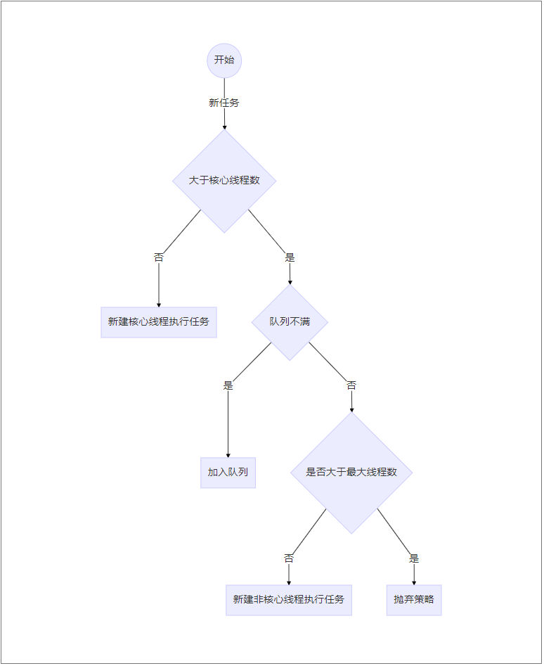
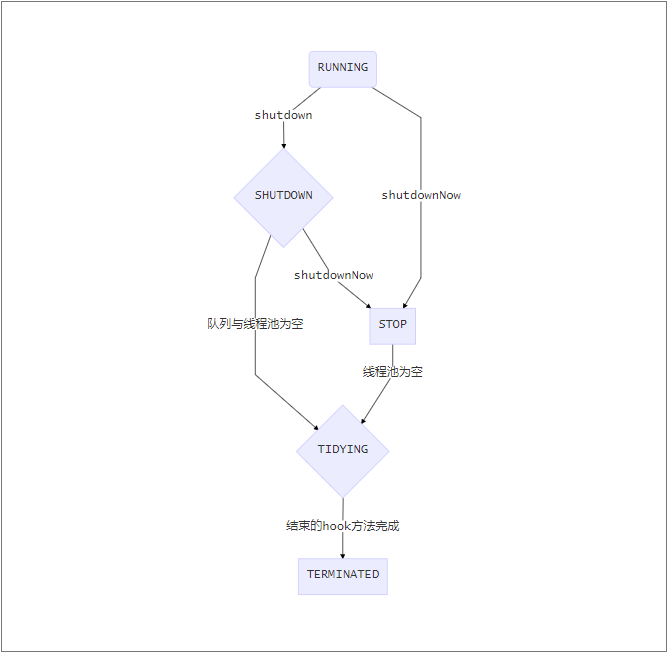
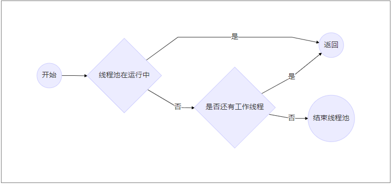
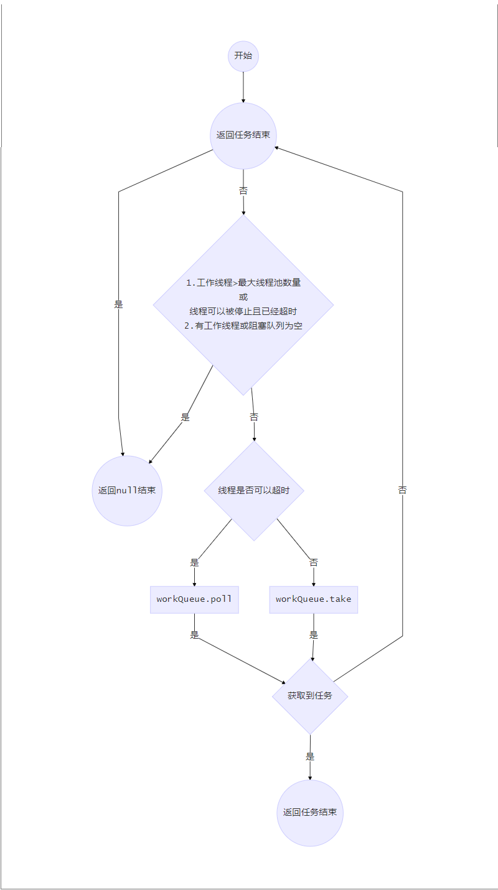
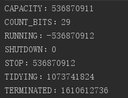

# java多线程--ThreadPoolExecutor源码解读

[[toc]]

## 线程池的域

| 名字                   | 备注                                   | 是否需要主锁 | 发布情况 |
| ---------------------- | -------------------------------------- | ------------ | -------- |
| ctl                    | 控制运行状态、有效的线程数             |              |          |
| workQueue              | 工作队列                               |              |          |
| mainLock               | 主锁                                   |              |          |
| workers                | 包含所有工作线程                       | √            |          |
| termination            | 等待支持awaitTermination的条件         |              |          |
| largestPoolSize        | 最大线程池大小                         | √            | √        |
| completedTaskCount     | 已完成的工作数量                       | √            |          |
| threadFactory          | 线程工厂                               |              | √        |
| handler                | 拒绝策略                               |              | √        |
| keepAliveTime          | 存活保持时间                           |              | √        |
| allowCoreThreadTimeOut | 为否时关键线程也会结束                 |              | √        |
| corePoolSize           | 关键线程数量                           |              | √        |
| defaultHandler         | 默认拒绝策略（（default）AbortPolicy） |              |          |
| maximumPoolSize        | 线程池最大数量                         |              | √        |

## 相关概念

- Core and maximum pool sizes（核心和最大线程数）

  

- Keep-alive times（最大持续时间）

   - 多余核心线程数的线程空闲存活时间
   - allowCoreThreadTimeOut设置后核心线程数空闲后的存活时间

- Queuing（排队）

  *存活的线程数大于核心线程数时加入队列排队*

  *队列分类*

  - 直接交付（SynchronousQueue）

    不排队，直接新建线程来执行

  - 无界队列（LinkedBlockingQueue）

    队列永远不会满，此时核心线程数可以和最大线程数一样

  - 有边队列（ArrayBlockingQueue）

- Rejected tasks（拒绝任务）

  *拒绝情况*

  - 队列已满且线程超过最大线程数

  - 线程池已经被停止

  *拒绝策略*（默认放弃）

  - AbortPolicy--抛出拒绝执行异常RejectedExecutionException
  - CallerRunsPolicy--调用execute方法的线程来执行
  - DiscardPolicy--直接拒绝
    - DiscardOldestPolicy--如果线程池没有停止，删除工作队列头部的任务，然后重试执行

## 线程池状态


## 常用方法详解

### 公有方法

- public void execute(Runnable command)

  > **在未来的某一时刻执行任务**
  >
  > 1. 小于核心线程数大小的线程在运行时，新增一个线程并将该任务当作其第一个将要执行的任务
  > 2. 当大于核心线程数时，尝试添加到阻塞队列中
  > 3. 无法添加到阻塞队列时，尝试添加一个新线程，添加失败则拒绝

- public void shutdown()

  > 有序关闭，先前提交的任务会被继续执行，但不会接受新任务
  >
  > 1. 设置线程池状态为SHUTDOWN
  > 2. 停止空闲线程

- ```java
  public List<Runnable> shutdownNow()
  ```

  > 停止所有正在执行的线程并返回等待被执行的任务
  >
  > 1. 设置线程池状态为STOP
  > 2. 停止所有工作线程
  > 3. 返回等待队列中的任务

- public boolean isShutdown()

  > 非RUNNING状态

- public boolean isTerminating()

  > SHUTDOWN/STOP/TIDYING状态

- public boolean isTerminated()

  > TERMINATED状态

- public boolean awaitTermination(long timeout, TimeUnit unit)

  > 等待一段时间后结束
  >
  > 1. 线程池已经是TERMINATED状态则返回true
  > 2. 等待时间结束，返回false

- public void setCorePoolSize(int corePoolSize)

  > 设置核心线程数
  >
  > 1. 如果当前新的核心线程数<原来的核心线程数则中止线程当它们执行完任务
  > 2. 如果新的核心线程数>原来的核心线程数，并且等待队列中有待执行的任务，则新增核心线程执行等待任务

- public boolean prestartCoreThread()

  > 提前开始一个核心线程 

- public int prestartAllCoreThreads()

  > 开始所有核心线程

- public void allowCoreThreadTimeOut(boolean value)

  > 允许核心线程超时停止
  >
  > 1. 设置allowCoreThreadTimeOut为true
  > 2. 停止线程当他们执行完任务之后

- public void setMaximumPoolSize(int maximumPoolSize)

  > 设置最大线程数
  >
  > 1. 设置最大线程数为新的最大线程数
  > 2. 若新的最大线程数小于原来的最大线程数，则停止工作线程在他们执行完任务之后

- public void purge()

  > 尝试移除所有的被取消的Future任务

### 非公有方法

- private boolean addWorker(Runnable firstTask, boolean core)

  > 1. 从线程工厂获取线程，并将firstTask传入作为初始执行任务
  > 2. 添加到workers
  > 3. 开始执行线程

- private void advanceRunState(int targetState)

  > 设置线程池状态为*SHUTDOWN*或 *STOP*

- private void interruptIdleWorkers(boolean onlyOne)

  > 将空闲线程设置为中断状态
  >
  > 判断空闲线程标准：tryLock方法是否成功

- private void interruptWorkers()

  > 中断所有线程

- ```java
  private List <Runnable> drainQueue()
  ```

  > 将任务队列放入新的集合中，如果是延时队列或者poll方法失败的队列则删除这些

- final void tryTerminate()

  

- final void runWorker(Worker w)

  > 1. 循环执行firstTask或从阻塞队列中获取到任务
  > 2. 为worker加锁
  > 3. 若线程池为*STOP*,则中止线程
  > 4. 执行beforeExecute
  > 5. 执行run方法
  > 6. 执行afterExecute方法
  > 7. 为worker释放锁

- private Runnable getTask()

  > 返回任务或返回null
  >
  > 返回null的情况
  >
  > 1. 多于maximumPoolSize的worker正在运行（执行了setMaximumPoolSize方法）
  > 2. 线程池状态>=STOP或线程池状态>=SHUTDOWN并阻塞队列为空
  > 3. 工作线程等待任务超时

    

  

## Worker


| 名字           | 备注                       |
| -------------- | -------------------------- |
| thread         | 从线程工厂获得的线程       |
| firstTask      | 首先要执行的任务，可以为空 |
| completedTasks | 已完成的任务               |

- Worker(Runnable firstTask)

  > 1. 设置firstTask
  > 2. 将run方法传入线程工厂获取新线程

- public void run() 

  > 执行runworker方法

- public void lock() 

  > 给worker加锁

- public boolean tryLock()

  > 尝试给worker加锁

- public void unlock() 

  > 给worker解锁

- public boolean isLocked() 

  > 待定

## 多线程中的常量

源码

```java
private static final int COUNT_BITS = Integer.SIZE - 3;
private static final int CAPACITY   = (1 << COUNT_BITS) - 1;
// runState is stored in the high-order bits
private static final int RUNNING    = -1 << COUNT_BITS;
private static final int SHUTDOWN   =  0 << COUNT_BITS;
private static final int STOP       =  1 << COUNT_BITS;
private static final int TIDYING    =  2 << COUNT_BITS;
private static final int TERMINATED =  3 << COUNT_BITS;

private static int runStateOf(int c)     { return c & ~CAPACITY; }
private static int workerCountOf(int c)  { return c & CAPACITY; }
private static int ctlOf(int rs, int wc) { return rs | wc; }
```

常量结果



## 常见疑问

- 如何在一个任务执行完毕后不结束？

  线程池中的线程独立存在，循环的调用执行目标任务的run方法

- 如何在没执行任务的时候保持阻塞？

  从阻塞队列中获取任务，queue.take获取不到时会阻塞