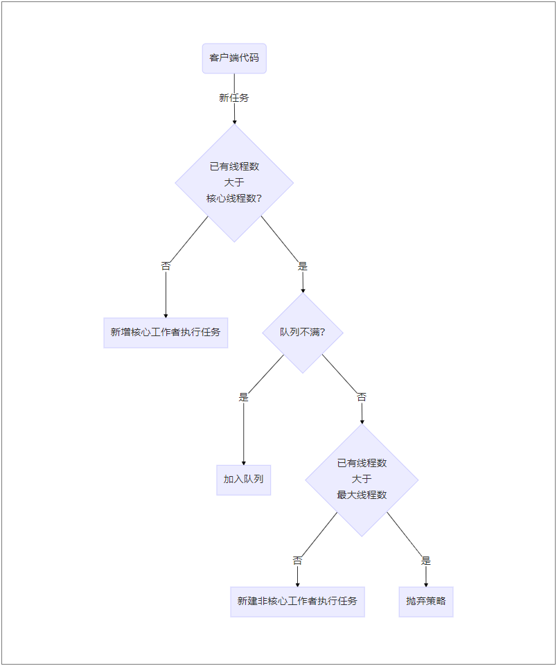

# ThreadPoolExecutor源码解读

[[toc]]
最近又对线程池的源码进行了阅读，子曰温故而知新，古人诚不我欺也

## 线程池的域

要了解一个类，那么就要首先知道它有哪些域，通过这些域才构成了这个对象，外界通过公有的方法来影响这些域从而影响这个对象。以下就将线程池中的较为重要的域进行了罗列

| 名字                   | 备注                                   | 发布情况 |
| ---------------------- | -------------------------------------- | -------- |
| ctl                    | 控制运行状态、有效的线程数             |          |
| workQueue              | 工作队列                               |          |
| mainLock               | 主锁                                   |          |
| workers                | 工作者线程                             |          |
| largestPoolSize        | 最大线程池大小                         | √        |
| completedTaskCount     | 已完成的工作数量                       |          |
| threadFactory          | 线程工厂                               | √        |
| handler                | 拒绝策略                               | √        |
| keepAliveTime          | 存活保持时间                           | √        |
| allowCoreThreadTimeOut | 为否时关键线程也会结束                 | √        |
| corePoolSize           | 关键线程数量                           | √        |
| defaultHandler         | 默认拒绝策略（（default）AbortPolicy） |          |
| maximumPoolSize        | 线程池最大数量                         | √        |

外界在对线程池进行操作时，会对上述域产生影响，根据其对外界的影响不同，这些域可以分为两类

- 严重影响：corePoolSize、maximumPoolSize、keepAliveTime、workQueue、threadFactory、handler、allowCoreThreadTimeOut
- 感知不到：ctl、mainLock、workers
- 记录信息：largestPoolSize、completedTaskCount

可以看到，对于严重影响这一类，我们在使用线程池的各个阶段，都需要密切关注与考虑，这些域都影响着线程池的行为，前六个就是我们新建线程池时需要传递的参数，这里不做解释，最后一个allowCoreThreadTimeOut是一个boolean型的变量，默认为false，如果设置为true，则核心线程也会受到keepAliveTime的影响，即超过空闲等待时间也会结束

那么对于感知不到的域，他们的作用又是什么呢，简单的说——它们实现了优化

- ctl：这是一个原子类对象，它将Integer分为了两部分，一部分用来记录当前线程池的状态，另一部分记录现有工作线程的数量
- mainLock：这是一个ReentrantLock锁，线程池的某些操作需要它来保证同步
- workers：这个域很重要，它是想想为什么要实现线程池？嗯，没错，就是它的功劳

当然在线程池的域中还有一些用来记录信息的变量

- largestPoolSize：该线程池到目前为止拥有的最大线程数
- completedTaskCount：已完成的任务的数量

## 新增任务流程图

为了让大家更好的了解线程池，我们首先将图中的概念和线程池中的变量名做一下对应关系

- 已有线程数：ctl中表示的一部分
- 核心线程数：corePoolSize
- 工作者：workers
- 队列：workQueue
- 最大线程数：maximumPoolSize
- 抛弃策略：handler



这个图大致看下来是没有问题的，但是仔细一想就有很多问题

- 核心工作者新建并执行完第一个任务之后就没用了吗？
- 队列中添加完任务谁来取来执行呢？

其实这两个问题可以一起来回答——核心工作者会不停的尝试取出队列中的任务来执行。那么接下来，我们就来看看工作者到底是如何实现的

## Worker

Worker作为ThreadPoolExecutor的一个内部类，我们同样先看一看它有哪些域


| 名字           | 备注                       |
| -------------- | -------------------------- |
| thread         | 从线程工厂获得的线程       |
| firstTask      | 首先要执行的任务，可以为空 |
| completedTasks | 已完成的任务数             |

Worker类同样实现了Runnable接口，在其run方法中，只有一行代码

```java
public void run() {
    runWorker(this);
}

final void runWorker(Worker w){
    //将worker的第一个任务当作要执行的任务
    Runnable task = w.firstTask;
    w.firstTask = null;
    try {
        //如果任务不为空或者可以获取到任务则执行任务
        while (task != null || (task = getTask()) != null) {
            try {
                task.run();
            }finally {
                task = null;
                //执行完毕，记录一下
                w.completedTasks++;
            }
        }
    }
}

private Runnable getTask() {
    boolean timedOut = false; // 判断上一次从队列中获取任务是否超时
    
    for (;;) {
        // 判断这个工作者是否会超时
        boolean timed = allowCoreThreadTimeOut || wc > corePoolSize;

        try {
            //如果这个工作者是可以超时的就是用poll等待一段时间，否则使用take一直等待
            //即不允许超时的核心工作者用take一直等待，超时工作者用poll等待一段时间
            Runnable r = timed ?
                workQueue.poll(keepAliveTime, TimeUnit.NANOSECONDS) :
            workQueue.take();
            if (r != null)
                return r;
            timedOut = true;
        } catch (InterruptedException retry) {
            timedOut = false;
        }
    }
}
```

::: tip

为节省篇幅以及去除不需要关注的代码，本文源码进行了删减，非Java源码

:::

从上述源码可以看到，核心工作者做完自己的第一个任务后会尝试从工作队列中获取任务来做

## hook方法

如果我们希望在每个任务执行前后都做一些事情，比如开始执行前通知某服务，执行结束后记录日志等，应该怎么做呢？线程池其实已经为我们提供了这些方法

```java
final void runWorker(Worker w){
    Thread wt = Thread.currentThread();
    Runnable task = w.firstTask;
    w.firstTask = null;
    try {
        while (task != null || (task = getTask()) != null) {
            try {
                //hook方法
                beforeExecute(wt, task);
                Throwable thrown = null;
                try {
                	task.run();
                } catch(Throwable x) {
                    thrown = x;
                    throw x;
                }finally {
                	//hook方法
                    afterExecute(task, thrown);
                }
            }
        }
    }
}
```

上述代码中添加*hook方法*注释的地方就可以完成我们的需求，它们都是protected方法，我们只需要继承线程池并重写这两个方法就可以了

当然除了以上两个hook方法之外，线程池还提供了一个hook方法——ThreadPoolExecutor#terminated，该方法在线程池结束后会被调用