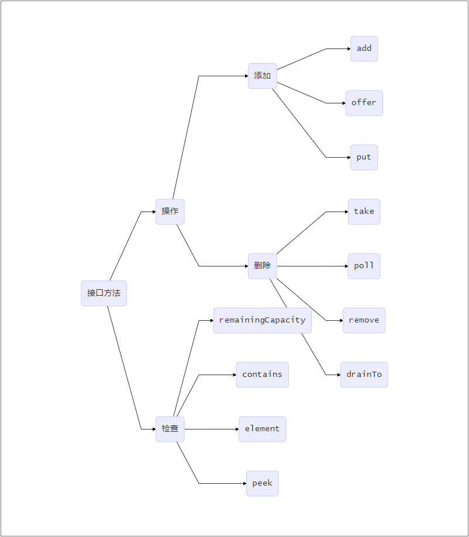

# 阻塞队列

说到多线程，就一定绕不开阻塞队列，本文就阻塞队列的共性与不同进行分析归纳

## 队列基础方法分析

所有的阻塞队列都实现了BlockingQueue接口，那我们就首先来看看BlockingQueue接口都有哪些方法

如上图所示，每一个阻塞队列都应该拥有上述方法，接下来我们针对不同的情况来对各类方法进行分析

对于添加而言，分为如下几类情况

1. 添加成功
2. 待添加元素不允许被添加到这个阻塞队列
3. 阻塞队列空间已满

对于第一种情况，三种添加的表现都是一致的，会返回true

对于第二种情况，三种添加的表现也是一致的，会抛出IllegalArgumentExecption

对于第三种情况，add方法会抛出IllegalStateException，offer方法会返回false，put方法则会一直等待，直到有空间可以使待添加元素被添加

对于删除的四个方法，其实各有不同，并不是对某些情况的不同处理。

- take方法会从队列中拿出头元素返回，如果队列为空会一直等待
- poll方法与take方法同理，但是会有一个等待时间，如果在这段等待时间内没有取到则会返回null
- remove方法则会从队列中找出第一个符合equals方法的元素并将其删除而后返回true，如果没找到则返回false
- drainTo则会将所有元素都装入入参的集合中返回

对于查看的四个方法，我们说一下element和peek

如果我们想要获取队列中的元素却不想删除它怎么办呢？就可以用element和peek了，这两个方法的区别就在于当队列为空时，element会抛出异常，peek会返回false

## 阻塞队列分类

上一节中我们讨论了阻塞队列中的方法，在本节中我们对阻塞队列接口的实现类进行分类分析，在ThreadPoolExecutor的源码注释中将阻塞队列分成了三种

- 直接交付（SynchronousQueue）

  不排队，直接新建线程来执行

- 无界队列

  - LinkedBlockingQueue

    实现方式：链表。队列永远不会满，此时核心线程数可以和最大线程数一样

  - PriorityBlockingQueue

    实现方式：可扩容的数组。优先级阻塞队列，要求被添加元素要实现Camparable接口

  - DelayQueue

    实现方式：可扩容的数组。延时队列，要求被添加的元素要实现Delay接口

- 有界队列（ArrayBlockingQueue）

  初始化时指定数量
