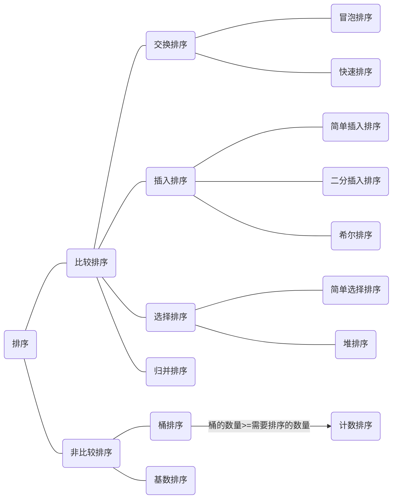

# 排序算法

#### 排序算法分类图

#### 算法比较图

| 算法名称     | 最好/最差/平均时间复杂度       | 空间复杂度 | 稳定性 |
| ------------ | ------------------------------ | ---------- | ------ |
| 冒泡排序     | O(N) / O(N^2) / O(N^2)         | O(1) | 稳定 |
| 简单选择排序 | O(N^2) / O(N^2) / O(N^2)       | O(1) | 不稳定 |
| 简单插入排序 | O(N) / O(N^2) / O(N^2)         | O(1) | 稳定 |
| 二分插入排序 | O(N) / O(NlogN) / O(NlogN) | O(1) | 稳定 |
| 希尔排序     | O(N) / O(N^2) / O(N^1.3)   | O(1) | 不稳定 |
| 堆排序       | O(NlogN) / O(NlogN) / O(NlogN) | O(1) | 不稳定 |
| 快速排序     | O(N) / O(N^2) / O(NlogN)       | O(NlogN) | 不稳定 |
| 归并排序     | O(NlogN) / O(NlogN) / O(NlogN) | O(N) | 稳定 |
|  |  |  |  |
| 基数排序     | O(NK) / O(NK) / O(NK) |            | 稳定 |
| 计数排序     | O(N+K) / O(N+K) /O(N+K)      |            | 稳定 |
| 桶排序       | O(N) / O(N^2) / O(N+K)  |            | 稳定 |

:::TIP 解释

基数排序中的K:待排序数组中最大值的位数

计数/桶排序中的K:待排序数组中的最大值

:::

:::TIP 相关概念

稳定：如果a原本在b前面，而a=b，排序之后a仍然在b的前面。

不稳定：如果a原本在b的前面，而a=b，排序之后 a 可能会出现在 b 的后面。

:::

#### 算法分析

##### 冒泡排序

教科书中一定会提到的算法，采用多次遍历的方式，每次遍历找出一个最大值并置于末尾

适用范围：所有可比较的数

##### 简单选择排序

采用多次遍历的方法，每次遍历选出一个最小值放于头部

适用范围：所有可比较的数

##### 简单插入排序  

假设当前排序数之前的数组有序，在之前的有序数组中**顺序**找出当前排序树应该插入的位置并插入

适用范围：所有可比较的数

##### 二分插入排序  

假设当前排序数之前的数组有序，在之前的有序数组中**使用二分算法**找出当前排序树应该插入的位置并插入

适用范围：所有可比较的数

##### 希尔排序  

又称为缩小增量排序，将待排序数组分为len/3+1份，对每一份进行简单插入排序

适用范围：所有可比较的数

##### 堆排序  

堆：完全二叉树

大根堆：父节点 > 叶子节点

小根堆：父节点 < 叶子节点

1. 将待排序数组当成完全二叉树：父节点>叶子节点，从最后一个非叶子节点进行堆调整
2. 将调整好的二叉树的根节点与最后一个节点进行交换，继续调整堆并重复该步骤

适用范围：所有可比较的数

##### 快速排序  

使用分治的思想

1. 选择最左侧值为key
2. 从右边遍历找到一个小于key的值right
3. 从左边遍历找到一个大于key的值left
4. 交换left、right
5. 重复2、3、4步骤直到左右指针重叠，交换key值和左指针的值
6. 对left左右两边的数组分别在进行上述步骤

适用范围：所有可比较的数

##### 归并排序  

使用分治的思想，将数组分解为一个个数，而后合并

适用范围：所有可比较的数

##### 桶排序  

将所有数根据特定的函数公式分别放入多个桶中，对每个桶进行排序

适用范围：所有可比较的数

##### 计数排序  

桶排序的极致

1. 找出最大值，即为需要准备的桶的数量
2. 将每个值入桶，而后遍历所有桶

适用范围：正整数

##### 基数排序  

1. 找出最大值，最大值的位数即为排序的次数
2. 准备10个桶，对每个数的当前位入桶，而后根据桶的顺序拿出

适用范围：正整数

#### Java代码示例

#### 参考博客

https://www.cnblogs.com/onepixel/articles/7674659.html