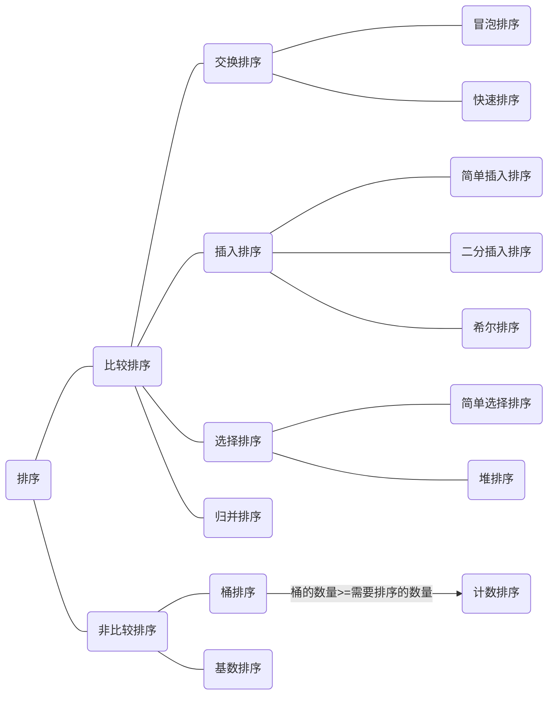

# 排序算法比较

#### 排序算法分类图

#### 算法比较图

| 算法名称     | 最好/最差/平均时间复杂度       | 空间复杂度 | 稳定性 |
| ------------ | ------------------------------ | ---------- | ------ |
| 冒泡排序     | O(N) / O(N^2) / O(N^2)         | O(1) | 稳定 |
| 简单选择排序 | O(N^2) / O(N^2) / O(N^2)       | O(1) | 不稳定 |
| 简单插入排序 | O(N) / O(N^2) / O(N^2)         | O(1) | 稳定 |
| 二分插入排序 | O(N) / O(NlogN) / O(NlogN) | O(1) | 稳定 |
| 希尔排序     | O(N^1.3) / O(N^2) / O(N)       | O(1) | 不稳定 |
| 堆排序       | O(NlogN) / O(NlogN) / O(NlogN) | O(1) | 不稳定 |
| 快速排序     | O(N) / O(N^2) / O(NlogN)       | O(NlogN) | 不稳定 |
| 归并排序     | O(NlogN) / O(NlogN) / O(NlogN) | O(N) | 稳定 |
|  |  |  |  |
| 基数排序     | O(NK) / O(NK) / O(NK) |            | 稳定 |
| 计数排序     | O(N+K) / O(N+K) /O(N+K)      |            | 稳定 |
| 桶排序       | O(N) / O(N^2) / O(N+K)  |            | 稳定 |

:::TIP 解释

基数排序中的K:待排序数组中最大值的位数

计数/桶排序中的K:待排序数组中的最大值

:::

:::TIP 相关概念

稳定：如果a原本在b前面，而a=b，排序之后a仍然在b的前面。

不稳定：如果a原本在b的前面，而a=b，排序之后 a 可能会出现在 b 的后面。

:::

#### 算法分析

冒泡排序

简单选择排序

简单插入排序  

二分插入排序  

希尔排序  

堆排序  

快速排序  

归并排序  

基数排序  

计数排序  

桶排序  

#### 代码示例

#### 参考博客

https://www.cnblogs.com/onepixel/articles/7674659.html